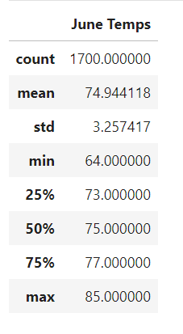
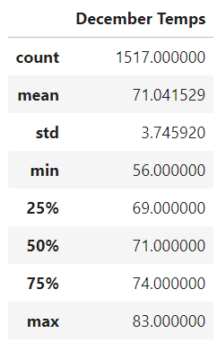

# surfs_up
## Project Overview
This project analyses weather of  Oahu, Hawaii for an investor (W. Avy), who plans on opening a surf and ice cream shop in that area. A surf and ice cream shop depends significantly on pleasant, warm weather to maintain a profitable operation. Using Python, Pandas functions and methods, and SQLAlchemy, we will generate the summary statistics for chosen months, as requested by W. Avy. Understanding the weather patterns will help determine if such a business may be viable for a large part of the year.

## Results

### Summary Statistics for month of June and December
 

Key variations in Summary Statistics between June and December:
  - Despite of the season and time of year, the maximum and average temperatures were extremely near. For example, the summertime high was 85 degrees, and the wintertime high was 83 degrees. This could indicate a stable demand for surf and ice cream.
  - December count data is less when compared with June (1700 observations verse 1517.). It may increase /decrease the temp difference. So the current data is not completely accurate.
  - December's minimum temperature was 56 degrees, whereas June's minimum temperature was 64 degrees. As a result, there might be a few more "off" days for business in December than in June.

## Summary 
Oahu would be a great location to open shop according to our analysis. Without any significant negative factor of weather present on business, W. Avy should feel confident about setting up the business.

### Further recommendations
  - Tourists consider other factors such as tides and wind speed to surf. Further analysis of these parameters will provide more clear picture of customer behaviour.
  - Rainy weather would decrease foot traffic and customers to our shop. Analysis of precipitation data on months is highly recommended.
  - With climate change as one of the big threats to the business, comparing Summary Statistics of aforementioned factors across years to study effect of climate change will help evaluate the viablity of business on long term basis.
